# Goal Tracker — Specification & Requirements Document

Version: 1.0 (derived from initial hand-drawn plan)
Stack: Flutter (client) → REST API → Quarkus/Spring (server) → PostgreSQL

---

## 0. Working Agreement with Claude Code

**Read this before every slice.**

This project is being implemented slice by slice with Claude Code. The following rules apply to every single slice, without exception:

1. **Plan first, always.** Before writing or modifying any code, present a clear plan (what will be built, files touched, key decisions) and wait for explicit approval before implementing.
2. **One slice at a time.** Do not implement, scaffold, or touch any other slice or feature beyond what was just approved.
3. **Security by default.** Apply security best practices relevant to the feature being built (input validation, auth checks, no secrets in code, parameterized queries, etc.) without being asked each time.
4. **Consistent conventions.** Follow best-practice naming and coding conventions for the relevant language/framework (Dart/Flutter, Java/Quarkus).
5. **Log every change.** After each slice is completed, add an entry to the progress log `claude-log.md` (date, topic, key decision, files touched, summary paragraph).

---

## 1. Overview

Goal Tracker is a mobile/web app (Flutter, single codebase) that lets a user set **yearly goals**, log **daily activities** against those goals, keep a **bucket list** of mini-goals for the year, view **summary charts** and a **calendar overview**, and manage multiple years of history (with automatic archiving of past years). Authentication is via Google OAuth or a local **Guest mode**, with data synced to the cloud.

---

## 2. Requirements

### 2.1 Functional Requirements
All of the following are **per year** unless noted otherwise:

1. Create yearly goals.
2. Update / delete goals.
3. Add daily activities (linked to a goal).
4. Update / delete activities.
5. Filter / sort activities by month and by goal.
6. View a summary chart (time spent per goal).
7. View a calendar color overview — a **categorical calendar** (not a heatmap, since color encodes *which* goal was worked on that day, not *how much* was done), presented as a **third view mode inside Daily Tracker** (alongside Table and Chart, §5.2) rather than a separate screen/tab. Days with a single goal show a solid-colored dot using that goal's **per-goal color** (§5.1); days with **more than one goal** show a small **pie wheel split into wedges**, one wedge per goal.
8. Add mini-goals to a "100 Bucket List".
9. Update / delete mini-goals.
10. Automatically move a passing year into an **Archives** section once a new year starts.
11. Usable on both mobile and web.
12. Authentication via Google OAuth, with a Guest mode fallback.
13. Search activities (by text).
14. Cloud data persistence (sync).

### 2.2 Non-Functional Requirements
- Easy to use / user-friendly / clean UI.
- Fast loading.
- Supports Thai (TH) and English (EN) locales.
- **Light mode is the application's default theme**, with **dark mode available as an opt-in toggle in Settings** (default off) — see §3.2. The overall palette stays **monochrome/grayscale** (black, white, grey) in both themes rather than a colored brand palette; functional/semantic colors (priority pills, status stamps, calendar goal colors) remain colored in both themes.
- Ability to generate a yearly summary report.

---

## 3. UX Workflow

```
Login
  └── Home
        ├── Yearly Goals (bottom tab) ── Goals (large) + Bucket List (small, same tab)
        ├── Daily Tracker (bottom tab, display label — internal entity stays "activities") ── Activity ── Filter ── View chart
        └── Hamburger menu (top left)
              ├── Profile / Settings ── (Google connect, language, name, dark/color theme, contact dev, backup & restore, about)
              └── Archives ── switch to older years
```

### 3.1 Screen Notes

**1. Login**
- Centered layout: the same customizable emoji icon style used as the app/year icon elsewhere (default e.g. 🚀) above the "Goal Tracker" app name, plus a short one-line tagline.
- **"Continue with Google"** — filled/primary button (dark fill, white text, Google icon) — the app's only "real" authentication path.
- **"Continue as guest"** — secondary, outlined button below it, for Guest mode (§6.2's `google_id = NULL` path).
- No email/password fields — authentication is Google-only or guest, nothing else.

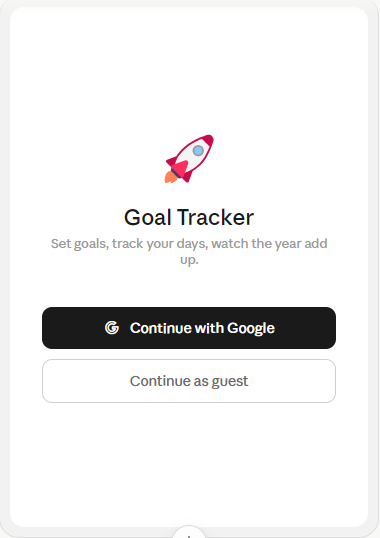

**2. Home — Yearly Goals tab**
- Top bar: a slim utility row with just the hamburger menu (opens Profile/Settings and Archives) and an edit/tick icon to toggle tab-text edit mode — no title text here.
- Directly below the top bar: a **left-aligned stacked header** — the **customizable icon** on the first line, then the **"{Year} Goal Tracker" title** on the next line in a **large, prominent font size**, both left-aligned to the same margin as the content below. The icon renders **directly on the page background, with no surrounding shape/tinted-square container** — Fluent Emoji flat assets already come on a transparent background, so an extra background container behind them is redundant. No separate "Yearly Goals" label is needed above the list — the page title already establishes context.

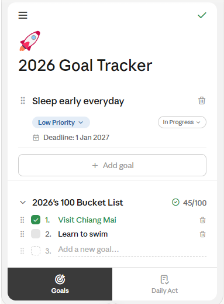 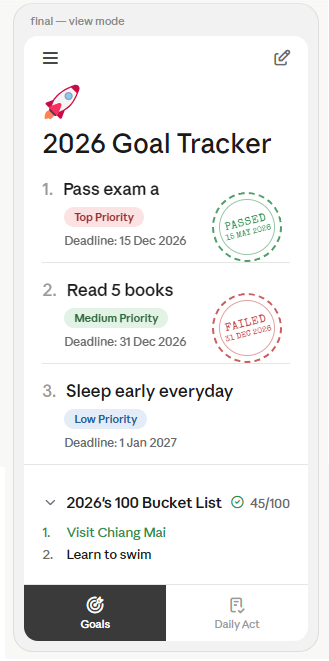

- **Capitalization convention for this app's UI** (distinct from Claude's own sentence-case UI copy): titles and field labels use the capitalization style the user actually types with — i.e. **Title Case for the app title and field labels** ("2026 Goal Tracker", "Top Priority", "Medium Priority", "Low Priority", "Deadline"), and **sentence case (first letter only) for user-entered names** (goal names, bucket-list items) — e.g. "Visit Chiang Mai" only because "Chiang Mai" is a proper noun, otherwise just capitalize the first letter of the entry.
- Body, top section — **Yearly Goals**, shown as a **numbered list** (not cards, no icons): "1. Pass exam a" in large/bold text. Underneath each goal, on its own line, a **priority pill** with a light semantic-tinted highlight — replacing plain "priority: high" text:
  - **Top Priority** → light red/pink highlight
  - **Medium Priority** → light green highlight
  - **Low Priority** → light blue highlight
  Below the pill, on its own separate line, plain unstyled text: "Deadline: 15 Dec 2026" (no highlight). **Deadline is a required field — there is no "ongoing"/open-ended option.** If the user doesn't pick one, default the field to **1 Jan of the following year** but still require them to confirm/set an explicit date. **Status stamps (view mode only):** a **Passed** goal gets a rotated ink-stamp visual reading "PASSED · {day} {Month} {Year}" (year always shown) in **green**; a **Failed** goal gets the **same shape and tilt**, just in **red** instead of green; an **In Progress** goal shows **no stamp at all**. The stamp is **modestly sized** (larger than a small accent icon, but still clearly secondary to the goal name) and sits **lower within the goal's row** (toward the bottom-right of the entry, near the deadline line) rather than large-and-dominant near the top. It should actually look like a rubber stamp: a **dashed outer ring with a thinner solid inner ring** (double-circle), and the text set in a **typewriter/stamp-style display font** (e.g. "Special Elite" or similar distressed monospace) rather than the app's normal sans-serif — not just a colored badge. The status itself is not editable from view mode — only the stamp (or its absence) is visible there.
- Body, lower section — **Bucket List**, separated from the Yearly Goals list above by **noticeably more vertical spacing** than between individual goal rows, so it reads as a distinct section rather than just another list item, shown directly below the goals on the same screen/tab (not a separate destination), as a **foldable/collapsible section** (chevron to expand/collapse):
  - Section header: "{Year}'s 100 Bucket List" in normal (non-muted) text weight/color — not faint — plus a **green checkmark icon in front of the count** (e.g. "✓ 45/100") so the count's meaning is clear at a glance. The title (with its chevron) and the checkmark+count group sit at **opposite ends of the header row**, with the checkmark+count group never wrapping or crowding against the title — the title truncates first if space is tight.
  - **Default (view) state**, when expanded: items show as a plain **numbered list**, each starting with a capitalized first letter (e.g. "1. Visit Chiang Mai"); a done item's text simply turns **green** — no strikethrough, nothing removed from the list.
  - **Edit mode**: the number prefix is replaced by a **checkbox** per item. Checked = green fill; unchecked = medium-light grey. Checkboxes only appear in edit mode, not in the default view.
  - New items appear in edit mode; tap the tab text to enter/exit edit mode.
- Bottom nav: minimized to two tabs — **Yearly Goals** and **Daily Tracker**. Profile and Archives are *not* bottom-nav tabs; they live only in the hamburger menu. Each tab shows a **small icon above its label** (not label-only). The **active tab's highlight is white text/icon on a dark grey background** (not pure black, and not blue/accent-colored) — consistent with the app's monochrome (grayscale, not colored) visual language (§2.2), whether the app is in light or dark mode. This icon-plus-label, dark-grey-highlight styling is consistent across every screen that shows the bottom nav (Home, Daily Tracker's Table/Chart/Calendar views, etc.) — it should never appear as label-only.
- Track-as: e.g. "1 time = 1 hour" style unit hints per goal where relevant.

**2.1 Edit mode (Yearly Goals tab)**
- A single edit toggle (the icon in the top-bar utility row) puts **both** the Yearly Goals list and the Bucket List into edit mode together — there isn't a separate toggle per section.
- The toggle icon itself: in view mode it's an edit/pencil icon; in edit mode it becomes a **checkmark ("save") icon, colored green, at the same size as the hamburger menu icon** (visual parity between the two top-bar icons).
- **Goals, in edit mode:**
  - Each row's top line holds the **drag handle, the editable name field, and the delete (trash) icon** together — the trash icon sits at the end of the **same line as the goal name**, not on its own row. The name field is a plain text input with **no underline styling**.
  - The next line holds the **priority pill on the left** and the **status control on the right, aligned to the same line** — tap the priority pill to pick Top / Medium / Low Priority; tap the status control to pick Passed / Failed / In Progress. This status control is **only visible in edit mode**; view mode never shows it, only the resulting stamp (or no stamp, for In Progress).
  - Below that, the deadline line: a small **calendar icon** followed by the same plain text style as view mode — "Deadline: 15 Dec 2026" — tappable to open a date picker.
  - The **trash icon** is styled in a **light/muted grey** rather than a warning color, so it reads as a low-emphasis, available action rather than something alarming.
  - An **"Add goal" affordance** sits below the list, styled in **light grey/muted text** to match its low visual priority relative to the goals themselves.
- **Bucket list, in edit mode:**
  - Each mini-goal row shows, in this left-to-right order: **checkbox, then number, then name** — e.g. "☐ 1. Visit Chiang Mai" — so the checkbox is the leading element but the number still matches view mode for easy cross-reference.
  - Mini-goals also get a **drag handle** for manual reordering, same as goals.
  - A **muted trash icon** per row, same low-emphasis grey styling as the goals list.
  - **No large "add" button** for the bucket list. Instead, a **blank, light-grey placeholder line** (with a dashed empty checkbox and muted placeholder text like "Add a new goal…") simply appears after the last mini-goal — tapping/typing into it creates a new item in place.

**2.2 Developer vs. user icon customization (design note) — DECIDED**
- The app/year icon is **emoji-based**: the user picks from a curated emoji list (e.g. 🚀 🎯 📚 💪), rather than a custom icon-pack glyph.
- **Rendering set: Fluent Emoji (Microsoft, open-source, `microsoft/fluentui-emoji`, flat style, MIT license)** — chosen so the icon renders identically across iOS, Android, and web rather than relying on each platform's native emoji font. Assets are available as individual SVGs (path pattern: `assets/{Emoji Name}/Flat/{emoji_name}_flat.svg`) and can be bundled directly into the app or served via a CDN mirror.
- The user only picks *which* emoji from the curated list; the rendering style itself is not user-configurable.

**4. Daily Tracker (display label — internal name stays "activities")**
- **Naming decision**: the screen and bottom-nav tab are labeled **"Daily Tracker"** to the user, evoking "goal" + "tracking" more than a plain activity log. This is a **display-label-only change** — the underlying entity, database table, and API endpoints keep their existing internal name (`Activity_Log`, `/activities`) rather than being renamed; the internal name doesn't need to match the UI label at all, and shouldn't be renamed just because the UI label changes again later. Claude Code should not rename the database table or endpoints for this.
- Top bar: just the hamburger menu.
- Header below the top bar: **"Daily Tracker"** in the same large left-aligned title style used on the Yearly Goals screen (no icon needed here — this isn't a customizable-icon screen).
- **Toolbar row** (below the header, all on **one line**): the **"Table" view-toggle pill** (light-grey background, table icon before bold black "Table" text, plus a chevron — switches between Table / Chart / Calendar, see §5, §5.2) on the left; on the right, a **search icon**, a **sort/filter icon** (drawn as three horizontal lines of decreasing length, stacked top-to-bottom, **center-aligned** rather than left-aligned — not the funnel-shaped "filter" glyph), a **settings icon** (adjustments/sliders glyph, plain — **no outline/border box** around it, same bare-icon treatment as search and sort/filter), and a small **"+" button** to add a new entry. No entry-count text is shown.
- **Table settings popup** (opened by tapping the settings button), kept minimal:
  - **Date format**: dropdown to change the date display format — the same setting reachable by tapping the "Date" column header.
  - **Duration format**: dropdown for Hour / Min / Mixed (§4.3) — the same setting reachable by tapping the "How long?" column header.
- **Table columns**: the table is **wider than the screen and scrolls horizontally** (left-right swipe/scroll) rather than squeezing columns to fit. Column headers are always **single-line** (no wrapping), separated by a **thin light-grey vertical rule** between columns, with a small icon before each header label — **use the filled/solid variant of each icon** here (book, calendar, magnet, bar-chart), not outline, for slightly more visual weight on column headers specifically. Each header is **tappable** to quickly change how that column behaves, without leaving the screen (see per-column notes below) — **tappable headers get no extra visual decoration** (no dotted underline or similar affordance hint); they look identical to the "What did I do?" header, which isn't tappable.
  - **"What did I do?"** (book icon) — free-text description of the activity, **capped at 150 characters**, and **entry does not allow newlines** — pressing enter/return in this field should not insert a line break (it's a single-line field, consistent with the column staying single-line in the table). This column is **narrow — literally only wide enough to show a handful of words before being cut off** (e.g. "Practice mock exam," or, if the cutoff lands mid-word, "Practice mock exa") — it stays **single-line**, does not wrap or stretch the row height, and is **hard-clipped with no ellipsis** (no "…") rather than a soft ellipsis truncation. Each cell has a small **"OPEN" button** next to the clipped text; tapping it opens a **plain, rounded-corner popup/modal showing the entry's full text**, with the **entry's date shown top-right of the popup in grey** (e.g. "30 Jul 2026") alongside the "what did i do?" label top-left.
  - **"Date"** (calendar icon) — always shown **with the year**, e.g. "15 May 2026"; column width is **fit-to-content** (sized to the date text, not a fixed wide column). **Tapping the "Date" header** opens a quick control to change the **date display format** (e.g. "15 May 2026" vs "15/05/2026" vs other locale formats) — this is a shortcut to the same setting that also lives in Settings.
  - **"Goal"** (magnet icon, appears before the label) — see §4.2 below for what's actually shown here and how the column is populated. Column is **narrow — capped at the width needed to fit the longest expected label** (e.g. "Sleep early everyday") — anything longer truncates **with an ellipsis** (this column keeps the ellipsis; only "What did I do?" uses hard clipping), so every goal pill renders at the same height. Each goal pill has a small **bold filled dot before the label** purely as a decorative marker (e.g. "● Exam A"), colored to match the pill's text color. **Tapping the "Goal" header** opens the **Goal settings screen** — a list of every goal for the current year, each with its **Display label** field and **preset color swatches** editable right there (§5.1) — an alternative, faster path to the same fields that are also editable on the Yearly Goals tab. Changes here affect both the Daily Tracker table and the Chart view, since both draw on the same per-goal label/color.
  - **"How long?"** (small horizontal-bar-chart icon, appears before the label with a small gap between the icon and the column's vertical separator line so it doesn't sit flush against it) — duration, **right-aligned** within a **narrow column** (unlike the other columns, which are left-aligned and wider); see §4.3 for the display formats. **Tapping the "How long?" header** opens a quick control to change the **duration display format** (Hour / Min / Mixed, §4.3) — again a shortcut to the same Settings-level preference.
- Row alignment: all cells in a row are **vertically centered** (the description column no longer wraps, so there's no need for top-alignment).
- **Adding an entry**: either the **"+"** button in the toolbar, or a light-grey **"+ New activity"** row at the bottom of the table. This row is preceded by the **same thin divider line used between all other rows** (so it reads as the next row in the table, immediately following the last real entry) and followed immediately by a **full-width horizontal divider line** beneath it too — styled so the add-row reads as part of the table itself (like one more row, bracketed by lines on both sides) rather than a separate button floating below it.

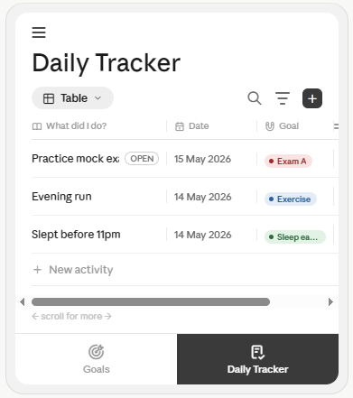 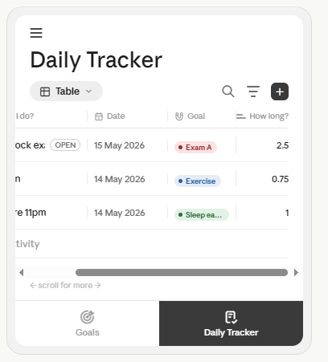 


**4.2 Goal linkage**
- The **Goal** column in the Daily Tracker table is a **dropdown populated from the current year's Yearly Goals list** — an activity entry is always linked to one existing goal via this dropdown, not free text.
- Each goal pill in the table shows that goal's **Display label** (falling back to the truncated full name if not set) and is colored using that goal's own **per-goal color** — see §5.1 for how both are set.

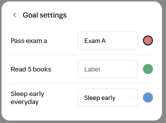

**4.3 Duration display preference**
- **Storage stays in minutes** (unchanged from §6.6) regardless of how it's displayed or entered.
- **Display format is a user preference** (set in Settings, or via the Table/Chart settings popups), with three options:
  - **Hour**: decimal hours, e.g. "1" for one hour, "0.5" for 30 minutes, "2.5" for two and a half hours.
  - **Min**: total minutes, e.g. "150" for two and a half hours.
  - **Mixed**: "Xh Ym" format, e.g. "2h 30m".
- **Data entry** always uses **separate hour and minute input fields** ("___ hour ___ min"), regardless of which display format (Hour / Min / Mixed) is selected for viewing — the two are independent settings (how you type it in vs. how it's shown in the table/chart).


**5. Daily Tracker — Chart View**
- Same top bar as the table view: hamburger only.
- Toolbar row: the view-toggle pill now reads **"Chart"**, always with a **pie-chart icon** in front (fixed — it doesn't change to a bar-chart icon even when the chart is currently showing as bars); tapping the pill's chevron offers **Table / Chart / Calendar** (§5.2). On the right: search icon, sort/filter icon, then a **settings icon** (adjustments/sliders glyph, plain — **no outline/border box**, matching the bare-icon style of search and sort/filter) sitting between the sort/filter icon and the "+" button, then the "+" button itself.

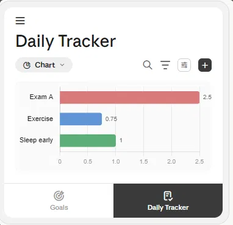

- **Chart settings live in a minimal popup**, opened by tapping the settings button — not as inline controls on the main screen. Keep it compact: a short list of rows (Type, Color, Value labels), each with a small compact control on the right, no card padding beyond what's needed, no placeholder/"coming soon" filler:
  - **Type**: Bar or Pie (small icon-button pair).
  - **Color**: Per-goal (default — each bar/slice colored using that goal's own color, §5.1) or Monocolor.
  - **Show value labels**: on/off toggle (default **on**).
- **Chart background**: only the **bar-plotting area itself** sits on a light-grey panel — **excluding the Y-axis label column** (goal names stay on plain white, not shaded) — a **light grey, not a darker/heavier grey**, sized tightly to the plot (no extra card padding around it that would make it read as a big separate panel). The rest of the screen stays plain white.
- **Chart colors** are **pastel but reasonably saturated** — clearly colored (a soft red, blue, green etc.), not so washed-out/desaturated that they look grey — matching each goal's own color (§4.2), not the priority-pill colors.
- **Chart content**: horizontal bar chart by default — Y-axis lists goals using their **Display label** if set (§5.1), X-axis is total duration (using the same decimal-hours/Xh-Ym display preference as the table, §4.3). Switching to Pie in settings shows the same data as a pie chart instead.
- Bottom nav: same two-tab pattern as every other screen — "Daily Tracker" as the active tab, shown with the dark-grey highlight (not black or blue), consistent with §3.1's navigation spec.

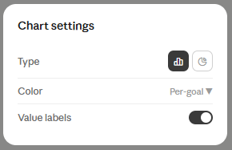

**5.1 Per-goal Display label and color**
- Each Yearly Goal has a **"Display label"** setting (renamed from the earlier working term "Short label" — this is the preferred name), editable from the **Yearly Goals tab** (e.g. while editing a goal): a compact name shown in the Daily Tracker table and chart instead of the full goal name.
- Alongside the Display label text field, the same setting lets the user **pick a color for that goal from a fixed set of preset swatches** — a small palette of curated colors (e.g. 6-8 preset options), not a free color picker/color wheel. This **per-goal color**, not the priority color, is what's used to color that goal's pill in the Daily Tracker table and its bar/slice in the chart — so two goals sharing the same priority (e.g. both "Medium Priority") can still be told apart visually. Priority pills on the Yearly Goals screen keep using the priority-tied colors (red/green/blue for Top/Medium/Low) as before; the per-goal color is a separate, independent identity used specifically in the Daily Tracker context.
- If no Display label is set, the table/chart fall back to the full goal name (truncated per the column-width rule in §4). If no color is chosen, fall back to a default neutral color.


**5.2 Daily Tracker — Calendar View**
- Lives as a **third option on the same view-toggle pill** used for Table and Chart (§4, §5) — tapping the pill's chevron now offers **Table / Chart / Calendar**, not just the two. Same top bar and toolbar icon set (search, settings, add) for consistency with the other two views.
- **Month navigation**: "‹ {Month} {Year} ›" above the day grid, with weekday initials as column headers.
- **Day cells** follow the categorical-calendar rule from §2.1, item 7:
  - No activity logged that day → a plain **light grey** dot (lighter than a mid-grey, closer to the page background so it recedes).
  - One goal logged that day → a solid dot colored with that goal's **per-goal color** (§5.1) — not the priority color.
  - More than one goal logged that day → a small **pie wheel split into wedges**, one wedge per goal, using each goal's per-goal color.
  - The current day's date number is shown in a slightly heavier/darker text weight than other days, for orientation.
- **Legend row** below the grid: small colored dots paired with each goal's Display label (or full name if none set), so the colors are identifiable without needing to tap into each day.

**5.3 Filter and sort (Table, Chart, Calendar)**
- **Filter popup**, titled **"Filter"** with a filter icon, opened by the sort/filter toolbar icon. For MVP it's organized by column/category, each with a small icon in front (matching the table's column icons) and a chevron leading to that category's options:
  - **Date** (calendar icon) — leads to a sub-screen with three modes:
    - **This** — pick "month" or "year", then the specific value (defaults to the current month).
    - **Past** — a number input (default **1**) plus a unit picker ("month(s)" / "year(s)").
    - **Range** — pick a starting Month+Year and an ending Month+Year (any years, not just the current one).
  - **Goal** (magnet icon) — filter to one or more goals.
  - **How long?** (bar-chart icon) — filter by duration.
- **Sort popup**, titled **"Sort"** with a small **up/down arrow icon** in front of the title (distinct from the filter icon, so the two popups are visually distinguishable at a glance), each row also with a small icon matching its column:
  - **What did I do?** (book icon) — "a → z" / "z → a".
  - **Date** (calendar icon) — **"old → new"** / "new → old" (not "newest first" — lowercase, arrow-based wording, consistent with the other sort labels).
  - **Goal** (magnet icon) — "a → z" / "z → a", or by the Yearly Goals `sort_order`.
  - **How long?** (bar-chart icon) — **"high → low"** / "low → high" (lowercase).
  - Default: **Date, new → old** (most recent activity first) — the most natural default for an activity log.
- **Chart sort** (same popup, chart-specific column set): two choices —
  - **Goal, ascending/descending** (default: **ascending**, using the **same order as the Yearly Goals tab** — i.e. each goal's `sort_order`, §3.1's drag-reorder) — an alternate variant groups by **priority first** (Top → Medium → Low), then ascending within each priority group.
  - **How long? (sum), ascending/descending**.
- Calendar has no sort control (a month grid has no meaningful row order to sort), but does share the same **Filter** popup and its Date sub-options.
- **Chart axis orientation, confirmed**: the chart is a **horizontal bar chart** — **X-axis = How long? (sum)**, **Y-axis = Goal** (using Display label per §5.1) — matching how it's been mocked up throughout, not the reverse.

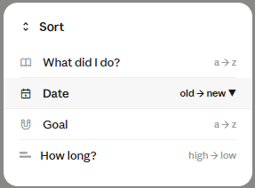 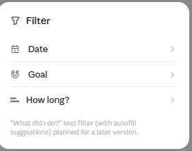 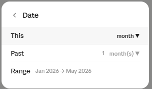 


**6. Navigation / Hamburger Menu**
- Presented as a **left-side sliding drawer** over a dimmed background, not a full-screen page.
- **Header** (top of drawer): a back chevron to close the drawer, an avatar (initials circle, e.g. "J"), and the user's display name.
- **Years section**: a "years" label, then a list of years the user has created, most recent first. The **current year is highlighted** (light-grey pill background) with a checkmark on the right; other years are plain rows — tapping one switches the active year shown on Home/Daily Tracker.
- **"Add a year"** row (muted grey, "+" icon) below the year list opens the **year picker popup**:
  - Shown as a simple list of years, most recent/latest at the top and **selected by default**.
  - Years that **already exist are greyed out and not selectable** (kept in the list for context, not hidden, so the user can see why a year is unavailable).
  - "Cancel" / "Add" actions at the bottom; "Add" is the only accent-filled action in the popup.
- **Settings** row pinned to the **bottom of the drawer**, separated by a divider — a gear icon and "Settings" label, leading to Profile/Settings (§3.2). Archives isn't a separate row here; browsing older years *is* the archive experience — selecting a non-current year from the years list opens that year's data in the same Home/Daily Tracker screens, read into that year's context.
- Just above the Settings row, a small **quiet sync-status line** (muted grey, no icon) — the passive save-status indicator described in §6.5: reads **"Synced at {HH:MM}"** normally, or **"Waiting to sync"** (or, after an extended delay, "Hasn't synced in a while") if a sync is pending/failed. Updates silently in the background; not interactive, not flashing, just there if the user checks.

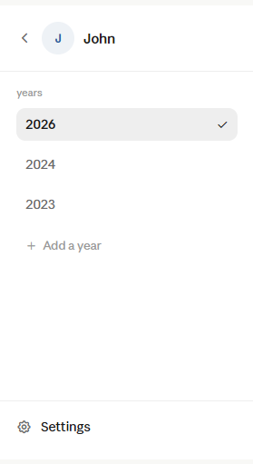

**3.2 Profile / Settings**
- Reached from the hamburger menu's "Settings" row (§6); a standard page, not a bottom-nav tab. Page header: back chevron, a small gear icon, and "Settings" title, kept casual/minimal rather than formally sectioned.
- Below the header: **centered profile block** — avatar (initials circle) on its own line, the display name directly below it, centered. No "Connected with Google" caption here (that's now its own row below).
- A single flat list of rows follows (no bold section-caption dividers — keeps it feeling lighter/less formal), each with a **small monochrome icon** in front:
  - **Connected with Google** (Google icon) — a navigational row (chevron), not itself a "disconnect" button; tapping it opens account detail, where disconnecting lives as an action.
  - **Language** (globe/language icon) — TH/EN dropdown.
  - **Notifications** (bell icon) — on/off toggle. Non-functional-requirement-level only for now — no specific notification content/timing is specified yet.
  - **Dark mode** (moon icon) — on/off toggle, **default off** (see §2.2 — light mode is the app's default theme, not dark).
  - **Backup & restore** (cloud icon) — navigational row.
  - **Contact developer** (mail icon) — navigational row.
  - **About** (info icon) — navigational row.
- **Date format** and **Duration format** are **not shown here** — they live exclusively in the Daily Tracker's Table/Chart settings popups and column-header shortcuts (§4), not duplicated on this screen.
- Per-goal **Display label / color** (§5.1) is also **not** listed here — it's goal-scoped, not app-scoped, and lives in the Goal settings screen reached via the Daily Tracker "Goal" column header instead.

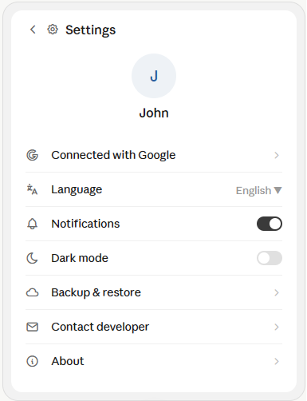

---

## 4. Data Model

### 4.1 Entities

**User**
| Field | Type | Notes |
|---|---|---|
| id | PK | |
| google_id | string, nullable | `NULL` when in Guest mode |
| username | string | |
| profile_pic | string, nullable | either the Google-provided photo URL, or a reference to a chosen preset avatar (no custom upload) — see §6.8; falls back to the initials-circle avatar (§3.2) if null |
| language | string | TH / EN |
| email | string | |
| created_at | timestamp | |
| updated_at | timestamp | |
| last_login_at | timestamp | |

**User_Years** (one row per year a user has "opened")
| Field | Type | Notes |
|---|---|---|
| id | PK | |
| user_id | FK → User.id | |
| year | int | |
| created_at | timestamp | |

**Yearly_Goals**
| Field | Type | Notes |
|---|---|---|
| id | PK | |
| goal_name | string | |
| short_label | string, nullable | renamed **display_label** in the UI (see §5.1); optional compact display name used only in the Daily Tracker table/chart; falls back to `goal_name` (truncated) if not set |
| goal_color | enum (from a fixed preset palette), nullable | user-chosen color for this goal, picked from a curated set of presets — not a free color picker — set alongside `display_label` (§5.1); used for the goal's pill in the Daily Tracker table and its bar/slice in the chart — independent of the priority-tied colors used on the Yearly Goals screen itself. Falls back to a default neutral color if not set. |
| priority | enum/int | |
| deadline_date | date, **not null** | required — no open-ended/"ongoing" goals; UI defaults the picker to 1 Jan of the following year but the user must confirm an explicit date |
| pass_date | date, nullable | set when status becomes PASSED |
| status | enum | PASSED / FAILED / IN_PROGRESS — drives the view-mode stamp: green for PASSED, red for FAILED, no stamp for IN_PROGRESS. Editable only via the status control in edit mode. |
| year_id | FK → User_Years.id | |
| sort_order | int | user-controlled manual ordering, set by drag-reorder in edit mode (§3.1) |
| created_at | timestamp | |
| updated_at | timestamp | |

**Activity_Log**
| Field | Type | Notes |
|---|---|---|
| id | PK | |
| description | string, max 150 chars | shown truncated in the Daily Tracker table with an "OPEN" button to view the full text (§4) |
| activity_date | date | |
| goal_id | FK → Yearly_Goals.id, **not null** | selected via dropdown from the current year's Yearly Goals list in the Daily Tracker UI (§4.2) — not free text |
| duration_min | int | stored in minutes; see §6.6 |
| created_at | timestamp | |
| updated_at | timestamp | |

**Bucket_List**
| Field | Type | Notes |
|---|---|---|
| id | PK | |
| mini_goal_name | string | |
| status | enum | done / not done |
| year_id | FK → User_Years.id | |
| sort_order | int | user-controlled manual ordering, set by drag-reorder in edit mode; also determines the number shown in view mode (§3.1) |
| created_at | timestamp | |
| updated_at | timestamp | |

### 4.2 Relationships
- `User` 1–N `User_Years` (a Guest user has `google_id = NULL`).
- `User_Years` 1–N `Yearly_Goals`, 1–N `Bucket_List`.
- `Yearly_Goals` 1–N `Activity_Log`.

---

## 5. API Contracts

Base convention: JSON over HTTPS, JWT bearer auth on all endpoints except `/login`.

### 5.1 Auth & User
| Method | Path | Description |
|---|---|---|
| POST | `/login` | Authenticate (Google or Guest), returns JWT |
| POST | `/logout` | Invalidate session |
| POST | `/user` | Create user |
| GET | `/users?id=` | Get user info |
| PUT | `/users?id=` | Update user info |

### 5.2 Yearly Goals
| Method | Path | Description |
|---|---|---|
| GET | `/yearly-goals?year_id=` | Get all of the user's goals for a year |
| POST | `/yearly-goals?year_id=` | Create a goal |
| PUT | `/yearly-goals?year_id=` | Update a goal |
| DELETE | `/yearly-goals?year_id=` | Delete a goal |

### 5.3 Bucket List
| Method | Path | Description |
|---|---|---|
| GET | `/bucket-list?year_id=` | Get all bucket-list items for a year |
| POST | `/bucket-list?year_id=` | Add a new mini-goal |
| PUT | `/bucket-list?year_id=` | Update a mini-goal |
| DELETE | `/bucket-list?year_id=` | Delete a mini-goal |

### 5.4 Activities
| Method | Path | Description |
|---|---|---|
| GET | `/activities?year_id=` | Get all activities for a year |
| POST | `/activities?year_id=` | Create an activity |
| PUT | `/activities?year_id=` | Update an activity |
| DELETE | `/activities?year_id=` | Delete an activity |
| GET | `/activities?search=` | Search activities |

### 5.5 User Years
| Method | Path | Description |
|---|---|---|
| POST | `/user-years` | Create a user's year |
| PUT | `/user-years?year_id=` | Change/rename a year (picker shows existing years grayed out) |
| GET | `/user-years` | Get all of a user's years |
| GET | `/user-years?year_id=` | Get a specific year |
| DELETE | `/user-years?year_id=` | Delete a year **and all related rows** (goals, activities, bucket items) behind a confirmation dialog |

---

## 6. Business Rules & Special Cases — READ EVERY TIME

These rules are easy to silently violate during implementation. Re-check this section before starting **any** slice that touches auth, year management, goal/activity status, or sync.

### 6.1 Authentication
- Use **JWT** for authentication on all endpoints except login.
- Guest mode is a fully valid account state: `User.google_id = NULL`. Do not assume `google_id` is always present.

### 6.2 Guest → Google Migration
When a Guest user logs in with Google and guest data already exists:
1. Prompt: **"Import your guest data?"**
2. If **yes**:
   - Reassign the guest data's `user_id` to the existing/new Google account.
   - Delete the guest record afterward.
3. If data exists on **both** accounts (guest and Google):
   - Update all `user_id` references on the migrating data.
   - If a goal name collides with an existing goal in the **same year**, block the migration for that item and prompt the user to rename one of them first (locally), e.g.: *"You have a goal named '{X}' in both, please rename them first."*
   - If **both accounts have a `User_Years` row for the same year**, keep one (the surviving id), repoint all its children (goals, activities, bucket items) to that surviving id, then delete the now-empty duplicate `User_Years` row.
4. Any DB write during migration must be transactional — **if any error occurs, roll back the entire migration.**

### 6.3 Year Visibility & Navigation
- Only the **most recent** `User_Years` row opens automatically when the app launches.
- Any year that is **not** the most recent is only shown when the user explicitly picks it from the **Archives** tab / year picker.
- The "Add a year" popup:
  - Cannot create a duplicate year.
  - Defaults to selecting the latest (next) year.
  - Renders years that already exist in a grayed-out / transparent state so they cannot be reselected.
- Creating a year via the UI does **not** immediately create rows for `Yearly_Goals` / `Activity_Log` / `Bucket_List` — those only persist to the DB once the user actually adds data. The `User_Years` row itself is created when the user creates the year.

### 6.4 Status & Year Rollover
- Goal `status` values: `PASSED`, `FAILED`, `IN_PROGRESS`.
- When a new year starts, **do not migrate/copy** goals or mini-goals into the new year. Each new year starts completely fresh ("set sail newly again").
- A goal/mini-goal's status, once set, is **not** changed retroactively when the year rolls over — it simply stays as historical record in its own year.

### 6.5 Real-Time Save Strategy
Applies to inline-editable views (e.g. Bucket List, Daily Tracker table) where there's no explicit "Save" button, Notion-style:
1. **Local-first**: every keystroke/change updates local state immediately (optimistic UI).
2. **Debounced sync**: 5 seconds after typing/editing *stops* (not on a fixed 5s interval regardless of activity), push the change to the server — this keeps continuous typing from spamming the API with a request per keystroke.
3. **Flush on exit**: if the user backgrounds the app or navigates away before the 5s debounce fires, flush the pending change immediately rather than waiting or losing it.
4. **Save status lives in one place: the hamburger menu** (§6) — no separate on-screen indicator anywhere else, and nothing is ever pushed at the user while they're editing:
   - **Normal case (sync succeeds)**: a quiet **"Synced at {HH:MM}"** line, muted grey, no icon.
   - **When sync fails or is pending** (offline, error): the same line switches to **"Waiting to sync"**, still muted grey — not red/amber, not a warning icon — since nothing is actually at risk (editing is local-first per point 1 above).
   - **If unsynced for an extended period** (e.g. many hours or across several app relaunches), the wording can shift to something like "Hasn't synced in a while" for a gentle nudge, staying in the same muted grey styling rather than escalating to a warning color.
   - This line simply updates itself once a retry succeeds — the user never has to manually trigger a retry, acknowledge anything, or dismiss a popup. They only ever see it if they choose to open the drawer.
5. **The app never blocks or asks the user to choose a "mode."** There's no decision for the user to make — their data is already safe locally regardless of sync status. No modal dialog, no "work offline? Yes / Close app" prompt, nothing that interrupts the task at hand.
6. **What causes a sync failure, and how each resolves automatically:**
   - **No internet connection** (most common) — listen for connectivity changes and retry automatically the moment the connection returns; no user action needed.
   - **Server error / backend downtime** — retry with exponential backoff (e.g. 5s, then 15s, then 30s…) rather than hammering the server repeatedly.
   - **Expired auth token** — attempt a silent token refresh first; only if that also fails does the user eventually need to re-authenticate, and even then no local data is lost — they just reconnect when convenient.

### 6.6 Duration Handling
- Store `duration_min` in the database **as minutes** (integer), regardless of the display unit chosen by the user.
- The UI lets the user choose a **display preference** — **Hour** (decimal hours, default, e.g. "1", "0.5", "2.5"), **Min** (total minutes, e.g. "150"), or **Mixed** ("Xh Ym", e.g. "2h 30m") — but this is presentation-only; see §4.3 for the full behavior on the Daily Tracker table.
- **Data entry always uses separate hour and minute fields** ("___ hour ___ min") regardless of the chosen display format.
- Default/placeholder suggestion for a new activity's duration: **60 minutes**.
- Special counting rule: activities like **"sleep"** or goals that are **completion-based** (done/not-done rather than timed) count as **1 hour (60 min)** toward duration totals/charts by convention.

### 6.7 Year Deletion
- Deleting a `User_Years` row cascades to delete all its `Yearly_Goals`, `Activity_Log`, and `Bucket_List` rows.
- Always show a confirmation dialog before this destructive action, e.g.:
  > "Delete 2025 and all its goals, activities, and bucket items? This cannot be undone."
- The delete operation must be wrapped in a transaction; roll back entirely on any error.

### 6.8 Profile Picture Handling
- **No custom image upload** — this avoids needing file/object storage infrastructure entirely. Instead:
  - **Google login**: use the profile picture URL Google already provides in the OAuth response, saved as-is into `User.profile_pic`.
  - **Guest mode, or a Google user who wants something else**: the user picks from a **curated set of preset avatars** (a small illustrated set, similar in spirit to the emoji-based app icon picker in §3.1's "2.2 Developer vs. user icon customization") rather than uploading a photo. `profile_pic` stores a reference to which preset was chosen (e.g. an identifier or the preset's bundled asset path), not an arbitrary URL.
  - If nothing is set (no Google photo, no preset chosen), the UI falls back to the **initials-circle avatar** (§3.2).

### 6.9 Report/Summary Export
- Format: **PDF**, generated on-device or server-side (implementation detail TBD), covering the requirement in §2.2 ("generate report summary year").
- Delivery: hand the generated PDF to the **OS's native share sheet** (e.g. `Share.share()` in Flutter) rather than building custom backend email sending. This gives the user "Save to device," "Email it to myself," "Send to Drive," "AirDrop," etc. for free from the OS, and — importantly — works identically for **Guest users** (who have no email on file) and Google users, with no conditional logic needed.
- No transactional email provider (SendGrid, SES, etc.) is needed for this feature, consistent with the earlier decision to skip email infrastructure for login.

---

## 7. Architecture

```
Flutter (UI, State Management, Repository layer, API client)
        │  REST/JSON + JWT
        ▼
Quarkus / Spring (Resource layer → Service layer → Repository layer)
        │
        ▼
PostgreSQL
```

- **Client (Flutter):** UI widgets → State management → Repository → API client. Single codebase targets both mobile and web.
- **Server (Quarkus or Spring):** Resource (controller) layer → Service (business logic) layer → Repository (data access) layer → PostgreSQL.
- **Auth:** JWT issued at `/login`, validated on every other request.

---

## 8. Open Items / Not Yet Finalized
- File size/type limits and any resizing for the preset avatar assets (§6.8) — minor, not blocking.

## 9. Future / Post-MVP
- **"What did I do?" text filter** in the Daily Tracker Filter popup (§5.3), searching the free-text activity description — likely with **autofill/suggestion assistance** once there's a searchable history of past entries. Deliberately deferred; not part of the MVP filter set (Date / Goal / How long? only).
